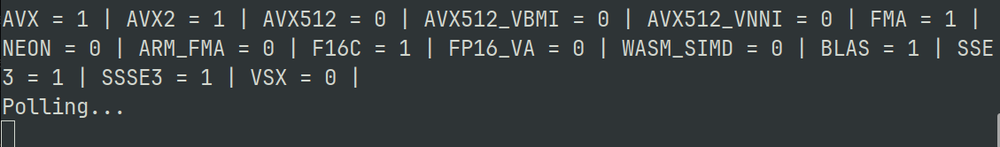

# Neural Style Transfer telegram bot project

## Overview
This project focuses on creating telegram bot with neural style transfer technique and AI assistant.

Neural Style Transfer is a deep learning technique that merges the content of one image with the artistic style of another, using neural networks to create visually stunning and unique images that blend content and style seamlessly.
## Model Architecture
* Model <b>VGG19</b>, pretrained using IMAGENET1K_V1 dataset, was used to implement NST algorithm. \
Loss function contains sum of <b>Content Loss (CL)</b> and <b>Style Loss (SL)</b>,where CL computes as <b>Mean Squared Error (MSE)</b> between picture on layer L and content image C. SL computes using MSE between picture on layer L mupliplied by transposed same picture (called <b>gram matrix</b>) and gram matrix of style image S.
* <b>Mistral-7B-instruct-v.0.1.Q5-K-M</b> Large Language Model (LLM) by TheBloke was used for AI assistant with instructions to answer only on related to project questions.
## Usage
If you want to use this bot:
1. Simply click on the [link](https://t.me/styletrans_bot) and use <b>/start</b> button from the menu. You can also use <b>/help</b> to get info about this bot. 

If you want to create your own bot, based on this one:
1. You should firsly create your own bot in telegram using [BotFather](https://t.me/BotFather).
2. Clone the repository: Open a terminal, navigate to the desired directory, and run:
```bash
git clone https://github.com/Strongich/NSTBot.git
```
2. Go to folder with project and install virtualenv, write the following command and press Enter:
```bash
pip install virtualenv
```
3. Next create a new environment, write the following command and press Enter:
```bash
virtualenv name_of_the_new_env
```
### Example:
```bash
virtualenv nstbot
```
4. Next activate the new environment, write the following command and press Enter:
```bash
name_of_the_new_env\Scripts\activate
```
### Example:
```bash
nstbot\Scripts\activate
```
5. Write the following command and press Enter:
 ```bash
pip install -r requirements.txt
```
6. In order to be able to use your GPU for AI assistant, write the following command and press Enter:
```bash
CMAKE_ARGS="-DLLAMA_CUBLAS=on" FORCE_CMAKE=1 pip install llama-cpp-python
```

7. Create a .env file in src folder, where write your bot token and save:
```bash
TOKEN=<YOUR BOT TOKEN>
```
#### Do not share your token with anyone
8. To launch the bot, open folder with project and write the following command and press Enter:
```bash
python src/bot.py
```
9. To check, if your AI assistant runs on GPU, check the terminal and find parameter <b>BLAS</b>, if it's equal to 1, then you using GPU.

### Import note
The model for AI assistant is running on 30/32 layers, using 4.5GB of video memory. If your GPU doesn't have enough memory, you should:
* Use lighter model
* Change the parameter <i>n_gpu_layers</i> in file <b>model.py</b>
## Conclusion
In this project, we developed a NST model for creating visually stunning and unique images and AI assistant for answering the questions. By following the steps above, you can create your own bot.

Please refer to the project documentation,code and my bot for detailed implementation instructions and examples. Enjoy exploring and creating cool photos with your NST model and AI assistant!

Please refer to the project documentation and code for detailed implementation instructions and examples. 

## Author
This NSTBot project was developed by Vitenko Igor. If you have any questions or need further assistance, please contact igor.vitenko13@gmail.com.

